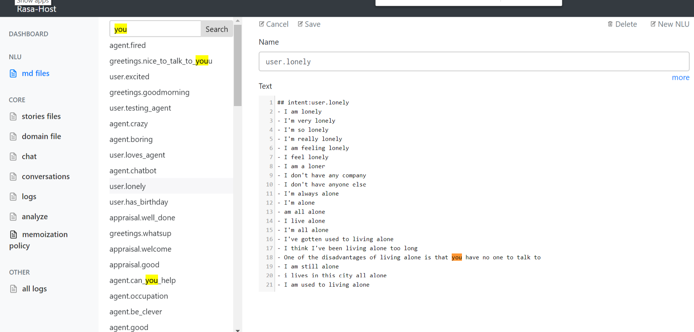
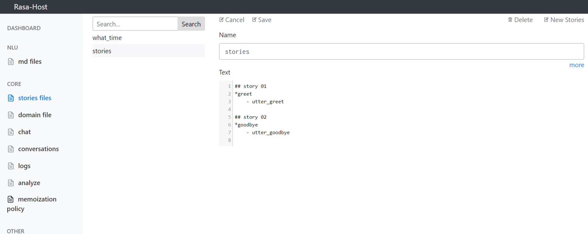
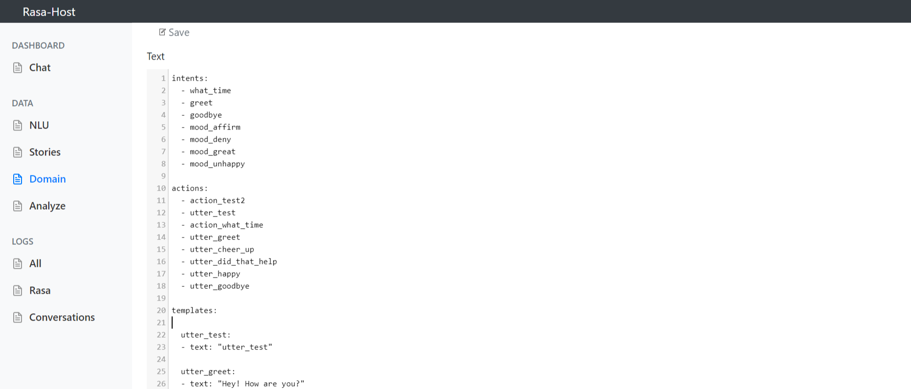
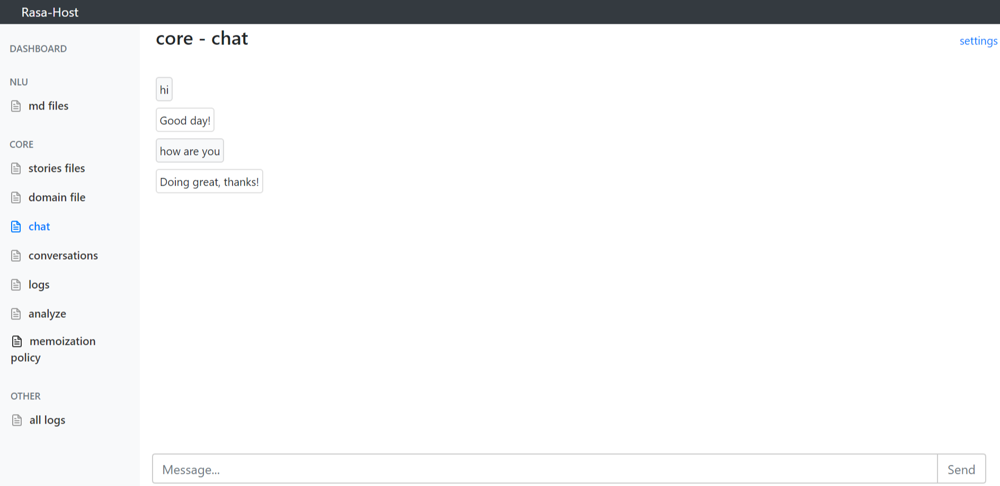

# RasaHost

ui and host for Rasa Nlu and Rasa Core.

The app has two functions. One is  editor for md files (intents, sotries, domain) in Rasa format,
that simplify looknig inside the files
and editing them.
* Getting started is beyond easy, you just have to specify the path to your files. 
* No migration is needed. The tool uses standard Rasa format.
* Does not have dependency on Rasa version. In fact does not have Rasa packages dependency.

Second function is logging. All conversations are saved in SQLite.
* To get started, you just have to create agent and bind it to the host.
* Conversations with details logs are saved in SQLite database. The app has interface to browser them.
* The logging can be mixed with standar logging to files and console, like Rasa does by default.
* Does not have dependency on Rasa version. In fact does not have Rasa packages dependency.


### Installation
pip install rasa-host

### Running
```python
from rasa_core.interpreter import RasaNLUInterpreter
from rasa_core.agent import Agent
interpreter = RasaNLUInterpreter('models/current/nlu')
agent = Agent.load("models/current/dialogue", interpreter=interpreter)

from RasaHost import host
host.set_data_path("path_to_directory_with_data")
host.agent = agent
if __name__ == '__main__':    
    host.run()
    # werkzeug  -  * Running on http://0.0.0.0:5005/ (Press CTRL+C to quit)
    
    # GET http://localhost:5005/conversations/daniel/respond?q={{message}}
```


### NLU - md files


### Core - stories files


### Core - domain file


### Core - chat


### Core - conversations


### Core - logs


### Core - analyze


### Actions
You can also host actions, with or without agent.
```python
from rasa_core_sdk.executor import ActionExecutor
actionExecutor = ActionExecutor()
actionExecutor.register_package('actions')

from RasaHost import host
host.actionExecutor = actionExecutor
if __name__ == '__main__':    
    host.run()
    # werkzeug  -  * Running on http://0.0.0.0:5005/ (Press CTRL+C to quit)
    # POST http://localhost:5005/actions
```

### Agent with actions
```python
from rasa_core.interpreter import RasaNLUInterpreter
from rasa_core.agent import Agent
from rasa_core import utils, server
from rasa_core_sdk.executor import ActionExecutor
#  #rasa-host.endpoints.yml
#  action_endpoint:
#  url: "http://localhost:5005/actions"
action_endpoint_conf = utils.read_endpoint_config("rasa-host.endpoints.yml", endpoint_type="action_endpoint")
interpreter = RasaNLUInterpreter('models/current/nlu')
agent = Agent.load("models/current/dialogue", interpreter=interpreter, action_endpoint=action_endpoint_conf)

actionExecutor = ActionExecutor()
actionExecutor.register_package('actions')

from RasaHost import host
host.set_data_path("path_to_directory_with_data")
host.agent = agent
host.actionExecutor = actionExecutor
if __name__ == '__main__':    
    host.run()
    # werkzeug  -  * Running on http://0.0.0.0:5005/ (Press CTRL+C to quit)
    
    # GET http://localhost:5005/conversations/daniel/respond?q={{message}}
    # POST http://localhost:5005/actions
```

### Channels
Supports channels. All the conversations will be logged.
```python
from rasa_core.channels.botframework import BotFrameworkInput
input_channel = BotFrameworkInput(
        app_id="",
        app_password=""
)

from RasaHost import host
host.agent = agent
host.channels = [input_channel]
if __name__ == '__main__':    
    host.run()
```


